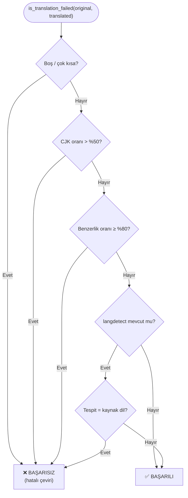
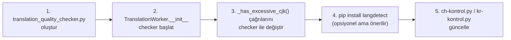

# Latin Alfabesi Kullanan Dillerde Çeviri Doğrulama — Geliştirme
## Yönergeler 
- Bu metinde çeviri kontrolü için temel gereksinimler ve öneriler yer almaktadır. Birebir aynısı yapılması gerekmemektedir. 
- Yeni modüller oluşturulabilir, yeni butonlar eklenebilir. Tam yetki veriyorum.
- Ana ekrandaki "Çeviri Hata Kontrol" butonu benzer işlemleri yerine getirmesi için düzenlenmesi gerekmektedir.
- Mevcut dosya yapısını file-tree.md dosyasından okuyabilirsin.
- Yeni eklenen modülleri requirements.txt dosyasına ekle.
- Yeni eklenen modülleri ve gereksinimleri setup.py dosyasına ekle.
- Yapılan güncellemeleri README.md dosyasını güncelleyerek ekle.

## Problem Analizi

### Mevcut Durum

`ch-kontrol.py` ve `kr-kontrol.py` dosyaları yalnızca **CJK (Çince/Japonca/Korece)** karakterlerin varlığını sayarak çeviri hatası tespiti yapıyor. `translation_worker.py`'deki `_has_excessive_cjk()` metodu da aynı mantıkla çalışıyor. Bu yaklaşım şu diller için **tamamen işlevsiz** kalıyor:

| Kaynak Dil | Özgün Alfabe | Mevcut Kontrol | Sorun |
|---|---|---|---|
| İngilizce | Latin | ❌ Yok | Çevrilmemiş İngilizce, Türkçe'ye benziyor |
| Almanca | Latin + Umlaut | ❌ Yok | Alfabe aynı, tespit edilemiyor |
| Fransızca | Latin + Aksanlı | ❌ Yok | Alfabe aynı, tespit edilemiyor |
| Çince | CJK | ✅ Var | `ch-kontrol.py` — çalışıyor |
| Korece | Hangul | ✅ Var | `kr-kontrol.py` — çalışıyor |

### Kök Neden

```python
# translation_worker.py — satır 295-307
@staticmethod
def _has_excessive_cjk(text, threshold=0.50):
    """Sadece Çince/Korece karakterlere bakar. Latin diller için körlük var."""
    korean_count = len(KOREAN_PATTERN.findall(text))
    chinese_count = len(CHINESE_PATTERN.findall(text))
    cjk_ratio = (korean_count + chinese_count) / total_chars
    return cjk_ratio > threshold  # İngilizce metin için her zaman False döner!
```

İngilizce → Türkçe çeviride orijinal ve hedef alfabe **aynıdır (Latin)**. Dolayısıyla alfabe-tabanlı hiçbir kontrol bu hatayı yakalayamaz. Çevrilmemiş dosya başarılıymış gibi kaydedilir.

---

## Önerilen Çözüm: İki Katmanlı Kontrol Sistemi

Mevcut CJK kontrolünün **üzerine** iki yeni katman eklenir. Katmanlar sırayla çalışır; biri hatayı yakalayınca sonraki atlanır.

```
┌─────────────────────────────────────────────────────────────┐
│  Katman 0 (Mevcut)  │  CJK karakter oranı kontrolü         │
│                     │  Çince/Korece → Latin çeviriler       │
├─────────────────────────────────────────────────────────────┤
│  Katman 1 (Yeni)    │  Metin Benzerlik Oranı Kontrolü       │
│                     │  Orijinal ↔ Çeviri karşılaştırması    │
│                     │  ≥ %80 benzerlik → hatalı çeviri      │
├─────────────────────────────────────────────────────────────┤
│  Katman 2 (Yeni)    │  langdetect Dil Tespiti               │
│                     │  Çeviri metni kaynak dilde mi?        │
│                     │  Katman 1 yakalayamazsa devreye girer │
└─────────────────────────────────────────────────────────────┘
```

---

## Katman 1 — Metin Benzerlik Oranı Kontrolü

### Temel Fikir

Orijinal dosya ile çeviri dosyasının metinleri karşılaştırılır. Benzerlik oranı **%80 ve üzerindeyse** metin çevrilmemiş kabul edilir ve doğrudan hatalı sayılır.

Bu yöntem **tüm alfabe sistemleriyle** çalışır: Latin, CJK, Kiril, Arapça vb.

### Kullanılacak Kütüphane

Python standart kütüphanesindeki `difflib.SequenceMatcher` — **sıfır bağımlılık**.

```python
from difflib import SequenceMatcher

def _calculate_similarity(text_a: str, text_b: str) -> float:
    """
    İki metin arasındaki karakter düzeyinde benzerlik oranını döndürür.
    Sonuç: 0.0 (hiç benzer değil) → 1.0 (birebir aynı)
    """
    return SequenceMatcher(None, text_a, text_b).ratio()
```

### Neden %80 Eşiği?

- `%100` → Birebir aynı (kesin çevrilmemiş, ama nadiren bu kadar saf hata olur)
- `%80` → Başlık satırları, özel isimler, sayılar gibi değişmeyen kısımlar hesaba katıldığında çevrilmemiş bir metin bu eşiği rahatlıkla aşar
- `%80` altı → Gerçek çevirilerde bile bazı kelimeler/cümleler benzer kalabilir; bu oran normal çeviriyi yakalamamak için güvenli bir alt sınırdır

> [!IMPORTANT]
> Benzerlik hesabı **büyük/küçük harf ve boşluk normalizasyonu sonrası** yapılmalıdır. Bu sayede yalnızca büyük harf çevirisi (case conversion) gibi yüzeysel farklar yanlış negatif üretmez.

### Algoritma

```python
import re
from difflib import SequenceMatcher

def _normalize(text: str) -> str:
    """Karşılaştırma için metni normalize eder."""
    text = text.lower()
    text = re.sub(r'\s+', ' ', text)   # Çoklu boşlukları tekleştir
    text = text.strip()
    return text

def _is_too_similar_to_original(self, original: str, translated: str,
                                  threshold: float = 0.80) -> bool:
    """
    Çevrilen metnin orijinale benzerlik oranını hesaplar.
    
    Returns:
        True  → Benzerlik ≥ threshold → Çeviri başarısız (çevrilmemiş)
        False → Benzerlik < threshold → Çeviri muhtemelen başarılı
    """
    if not original or not translated:
        return False
    
    norm_original   = _normalize(original)
    norm_translated = _normalize(translated)
    
    # Çok kısa metinlerde SequenceMatcher güvenilmez
    if len(norm_original) < 30:
        return False
    
    ratio = SequenceMatcher(None, norm_original, norm_translated).ratio()
    
    app_logger.debug(f"Metin benzerlik oranı: {ratio:.3f} (eşik: {threshold})")
    
    if ratio >= threshold:
        app_logger.warning(
            f"Benzerlik kontrolü BAŞARISIZ: oran={ratio:.2%} ≥ {threshold:.0%} → çevrilmemiş!"
        )
        return True
    
    return False
```

### Dikkat Edilmesi Gereken Durumlar

> [!WARNING]
> **Yanlış Pozitif Riski:** Çok kısa bölümler (başlık satırları, tek cümleli bölümler) özel isimler içerdiğinde %80'in üzerinde benzerlik gösterebilir. `min_length=30` kontrolü bu riski azaltır. Gerekirse eşik `0.85`'e çıkarılabilir.

> [!NOTE]
> **Performans:** `SequenceMatcher` büyük metinlerde yavaşlayabilir. Bunun önüne geçmek için karşılaştırma **ilk 5000 karakter** ile sınırlandırılabilir; roman bölümleri için bu yeterlidir.

```python
# Performans optimizasyonu — büyük dosyalar için
MAX_COMPARE_CHARS = 5000
norm_original   = _normalize(original[:MAX_COMPARE_CHARS])
norm_translated = _normalize(translated[:MAX_COMPARE_CHARS])
```

---

## Katman 2 — `langdetect` Dil Tespiti

### Temel Fikir

Katman 1 benzerlik oranı **%80'in altında** kaldığında (yani kesin tespit yapılamadığında) `langdetect` devreye girer. Çeviri metninin dili tespit edilir; eğer **kaynak dille eşleşiyorsa** çeviri başarısız sayılır.

### Kurulum

```bash
pip install langdetect
```

~5MB, internet gerektirmez, offline çalışır.

### Deterministik Kullanım

`langdetect` varsayılan olarak rastgele seed kullanır; aynı metin için farklı çalıştırmalarda farklı sonuç üretebilir. **Seed sabitleme zorunludur:**

```python
from langdetect import DetectorFactory
DetectorFactory.seed = 0  # Uygulama başlangıcında bir kez çağrılmalı
```

### Algoritma

```python
def _detected_lang_matches_source(self, translated: str,
                                   source_lang: str,
                                   min_length: int = 50) -> bool:
    """
    Çeviri metninin tespit edilen dili kaynak dille eşleşiyor mu?
    
    Returns:
        True  → Tespit edilen dil = kaynak dil → çevrilmemiş!
        False → Farklı dil tespit edildi veya tespit başarısız
    """
    try:
        from langdetect import detect, LangDetectException
    except ImportError:
        app_logger.warning("langdetect bulunamadı, dil tespiti atlanıyor.")
        return False
    
    stripped = translated.strip()
    if len(stripped) < min_length:
        # Çok kısa metinlerde tespit güvenilmez
        return False
    
    try:
        detected = detect(stripped)
        app_logger.debug(f"langdetect tespiti: '{detected}' (kaynak: '{source_lang}')")
        
        if detected == source_lang:
            app_logger.warning(
                f"langdetect BAŞARISIZ: tespit='{detected}', "
                f"kaynak='{source_lang}' → çevrilmemiş metin!"
            )
            return True
    except LangDetectException as e:
        app_logger.debug(f"langdetect tespiti başarısız: {e}")
    
    return False
```

### Bilinen Sınırlılıklar

> [!WARNING]
> **Karışık Dil Problemi:** Türkçe çeviri içinde çok sayıda İngilizce özel isim (karakter adları, yer adları) varsa `langdetect` metni İngilizce olarak sınıflandırabilir. Bu durumda yanlış pozitif üretilir. Katman 2 bu nedenle **yalnızca Katman 1 başarısız olunca** çalışmalıdır — tek başına kullanılmamalıdır.

> [!NOTE]
> **Dil Kodu Eşleştirme:** `langdetect` ISO 639-1 kodları kullanır (`"en"`, `"tr"`, `"zh-cn"` vb.). Proje ayarlarındaki `source_lang` değerinin bu formatla uyumlu olması gerekir.

---

## Birleşik `TranslationQualityChecker` Tasarımı

### Dosya Yapısı

```
core/
├── workers/
│   ├── translation_worker.py           # Mevcut
│   └── translation_quality_checker.py  # 🆕 YENİ MODÜL
├── ch-kontrol.py                       # Mevcut — güncelleme önerilir
└── kr-kontrol.py                       # Mevcut — güncelleme önerilir
```

### Tam Implementasyon

```python
"""
translation_quality_checker.py
───────────────────────────────
Çevirinin başarısız olduğunu tespit eden çok katmanlı kontrol modülü.

Kontrol sırası:
  0. Boşluk / kısalık anomalisi   → tüm diller
  1. CJK karakter oranı           → Non-Latin kaynak diller (mevcut mantık)
  2. Metin benzerlik oranı        → tüm diller (primer, sıfır bağımlılık)
  3. langdetect dil tespiti       → Katman 2 yakalamazsa devreye girer
"""

import re
from difflib import SequenceMatcher
from logger import app_logger

# Deterministik langdetect — uygulama başlangıcında bir kez çağrılır
try:
    from langdetect import DetectorFactory
    DetectorFactory.seed = 0
except ImportError:
    pass

# CJK pattern (mevcut translation_worker.py ile uyumlu)
_CJK_PATTERN = re.compile(
    r'[\u4e00-\u9fff\uac00-\ud7a3\u1100-\u11ff\u3130-\u318f]'
)


def _normalize(text: str) -> str:
    """Karşılaştırma için metni normalize eder (küçük harf + boşluk tekleştirme)."""
    text = text.lower()
    text = re.sub(r'\s+', ' ', text)
    return text.strip()


class TranslationQualityChecker:
    """
    Çeviri kalite kontrolcüsü.

    Kullanım:
        checker = TranslationQualityChecker(source_lang="en")
        if checker.is_translation_failed(original_text, translated_text, "dosya.txt"):
            # Yeniden çevir
    """

    def __init__(
        self,
        source_lang: str = "en",
        cjk_threshold: float = 0.50,
        similarity_threshold: float = 0.80,
        max_compare_chars: int = 5000,
        min_text_length: int = 50,
        use_langdetect: bool = True,
    ):
        self.source_lang = source_lang
        self.cjk_threshold = cjk_threshold
        self.similarity_threshold = similarity_threshold
        self.max_compare_chars = max_compare_chars
        self.min_text_length = min_text_length
        self.use_langdetect = use_langdetect
        self._langdetect_available = self._check_langdetect()

    # ── Yardımcı: langdetect mevcut mu? ────────────────────────────────────
    def _check_langdetect(self) -> bool:
        try:
            import langdetect  # noqa: F401
            return True
        except ImportError:
            app_logger.warning(
                "langdetect kütüphanesi bulunamadı. "
                "Dil tespiti devre dışı kalacak. "
                "Kurmak için: pip install langdetect"
            )
            return False

    # ── Kontrol 0: Boşluk / kısalık anomalisi ──────────────────────────────
    def _is_empty_or_too_short(self, original: str, translated: str) -> bool:
        if not translated or not translated.strip():
            return True
        if len(translated) < len(original) * 0.10:
            return True
        return False

    # ── Kontrol 1: CJK karakter oranı (mevcut mantık korunuyor) ────────────
    def _has_excessive_cjk(self, text: str) -> bool:
        total = len(text)
        if total == 0:
            return False
        count = len(_CJK_PATTERN.findall(text))
        return (count / total) > self.cjk_threshold

    # ── Kontrol 2: Metin benzerlik oranı ───────────────────────────────────
    def _is_too_similar_to_original(self, original: str, translated: str) -> bool:
        """
        Çeviri metninin orijinale benzerliği similarity_threshold'u aşıyor mu?

        Returns:
            True  → Benzerlik ≥ eşik → çevrilmemiş (hata)
            False → Benzerlik < eşik → muhtemelen çevrilmiş
        """
        if not original or not translated:
            return False

        # Büyük dosyalar için ilk N karakter ile karşılaştır
        norm_orig  = _normalize(original[:self.max_compare_chars])
        norm_trans = _normalize(translated[:self.max_compare_chars])

        if len(norm_orig) < 30:
            # Çok kısa metinlerde SequenceMatcher güvenilmez
            return False

        ratio = SequenceMatcher(None, norm_orig, norm_trans).ratio()
        app_logger.debug(f"Metin benzerlik oranı: {ratio:.3f} (eşik: {self.similarity_threshold})")

        if ratio >= self.similarity_threshold:
            app_logger.warning(
                f"Benzerlik kontrolü BAŞARISIZ: "
                f"oran={ratio:.1%} ≥ {self.similarity_threshold:.0%} → çevrilmemiş!"
            )
            return True

        return False

    # ── Kontrol 3: langdetect dil tespiti ──────────────────────────────────
    def _detected_lang_matches_source(self, translated: str) -> bool:
        """
        Çeviri metninin tespit edilen dili kaynak dille eşleşiyor mu?

        Returns:
            True  → Tespit = kaynak dil → çevrilmemiş!
            False → Farklı dil veya tespit başarısız
        """
        if not self.use_langdetect or not self._langdetect_available:
            return False

        stripped = translated.strip()
        if len(stripped) < self.min_text_length:
            return False

        try:
            from langdetect import detect, LangDetectException
            detected = detect(stripped)
            app_logger.debug(
                f"langdetect tespiti: '{detected}' (kaynak: '{self.source_lang}')"
            )
            if detected == self.source_lang:
                app_logger.warning(
                    f"langdetect BAŞARISIZ: "
                    f"tespit='{detected}' = kaynak='{self.source_lang}' → çevrilmemiş!"
                )
                return True
        except Exception as e:
            app_logger.debug(f"langdetect tespiti başarısız: {e}")

        return False

    # ── Ana metot: tüm katmanları çalıştır ─────────────────────────────────
    def is_translation_failed(
        self,
        original: str,
        translated: str,
        filename: str = "",
    ) -> bool:
        """
        Çeviri başarısız mı? True → yeniden çevrilmeli.

        Kontrol akışı:
          0. Boşluk/kısalık   → hızlı, evrensel
          1. CJK oranı        → Non-Latin kaynak diller için
          2. Benzerlik oranı  → primer kontrol, tüm diller, sıfır bağımlılık
          3. langdetect       → benzerlik yakalamazsa son koz
        """
        prefix = f"[{filename}] " if filename else ""

        # Kontrol 0
        if self._is_empty_or_too_short(original, translated):
            app_logger.warning(f"{prefix}KaliteKontrol: Çeviri boş veya çok kısa.")
            return True

        # Kontrol 1
        if self._has_excessive_cjk(translated):
            app_logger.warning(f"{prefix}KaliteKontrol: Aşırı CJK karakteri tespit edildi.")
            return True

        # Kontrol 2 — benzerlik oranı
        if self._is_too_similar_to_original(original, translated):
            app_logger.warning(f"{prefix}KaliteKontrol: Orijinale benzerlik ≥ %80 → hatalı çeviri.")
            return True

        # Kontrol 3 — langdetect (Kontrol 2 yakalayamadıysa)
        if self._detected_lang_matches_source(translated):
            app_logger.warning(f"{prefix}KaliteKontrol: langdetect → kaynak dil tespit edildi → hatalı çeviri.")
            return True

        return False
```

---

## `TranslationWorker` Entegrasyonu

### 1. Başlatma (`__init__` içinde)

```python
# translation_worker.py
from core.workers.translation_quality_checker import TranslationQualityChecker

# __init__ içine ekle:
self._quality_checker = TranslationQualityChecker(
    source_lang=source_lang,   # Proje ayarından gelecek, örn: "en"
    similarity_threshold=0.80,
    use_langdetect=True,
)
```

### 2. Mevcut CJK çağrılarını değiştir

```diff
# ÖNCE (sadece CJK kontrol ediyor):
- if self._has_excessive_cjk(translated_text):
-     app_logger.warning(f"Çeviri sonucu CJK yüksek: {file_name}")

# SONRA (tam kalite kontrolü):
+ if self._quality_checker.is_translation_failed(content_text, translated_text, file_name):
+     app_logger.warning(f"Çeviri kalite kontrolünden geçemedi: {file_name}")
```

Bu değişiklik `_process_single_file`, `_translate_paragraphs` ve `parse_batch_response` içindeki **tüm** `_has_excessive_cjk()` çağrıları için uygulanmalıdır.

### 3. Geriye Uyumluluk

`_has_excessive_cjk()` metodu **kaldırılmamalıdır.** `TranslationQualityChecker` onu içeride kullanıyor; başka referanslar da bozulmaz.

---

## `ch-kontrol.py` Güncelleme Önerisi

Mevcut standalone script `TranslationQualityChecker` kullanacak şekilde genişletilebilir. Orijinal dosyalara erişim sağlanabileceğinden **benzerlik kontrolü de** yapılabilir:

```python
# ch-kontrol.py — güncelleme önerisi
import os
from logger import app_logger
from core.workers.translation_quality_checker import TranslationQualityChecker

def klasoru_tara(trslt_klasor, kaynak_klasor=None, source_lang="zh"):
    """
    trslt_klasor  : Çeviri dosyalarının bulunduğu klasör
    kaynak_klasor : Orijinal dosyaların bulunduğu klasör (benzerlik için)
    source_lang   : Kaynak dilin ISO 639-1 kodu
    """
    checker = TranslationQualityChecker(
        source_lang=source_lang,
        similarity_threshold=0.80,
        use_langdetect=True,
    )
    silinecek_list = []

    for dosya_adi in os.listdir(trslt_klasor):
        if not dosya_adi.endswith(".txt"):
            continue

        trslt_yolu = os.path.join(trslt_klasor, dosya_adi)
        with open(trslt_yolu, 'r', encoding='utf-8', errors='ignore') as f:
            ceviri = f.read()

        # Orijinal metin varsa benzerlik de kontrol edilir
        original = ""
        if kaynak_klasor:
            kaynak_yolu = os.path.join(kaynak_klasor, dosya_adi)
            if os.path.exists(kaynak_yolu):
                with open(kaynak_yolu, 'r', encoding='utf-8', errors='ignore') as f:
                    original = f.read()

        if checker.is_translation_failed(original, ceviri, dosya_adi):
            app_logger.info(f"Sorunlu: {dosya_adi} → silme listesine eklendi")
            silinecek_list.append(os.path.abspath(trslt_yolu))

    return silinecek_list
```

---

## Kontrol Akışı



---

## Uygulama Sırası



---

## Dikkat Edilmesi Gereken Durumlar


> [!WARNING]
> **Yanlış Pozitif — langdetect:** İngilizce özel isim yoğun Türkçe metinlerde `langdetect` yanlış "İngilizce" diyebilir. Bu nedenle `langdetect` **yalnızca benzerlik kontrolü sonrası** devreye girmelidir; tek başına kullanılmamalıdır.

> [!IMPORTANT]
> **Seed Sabitleme:** `DetectorFactory.seed = 0` uygulama başlangıcında **bir kez** çağrılmalıdır. Aksi takdirde `langdetect` deterministik olmaz; aynı metin farklı çalıştırmalarda farklı sonuç verebilir.

> [!NOTE]
> **Performans:** `SequenceMatcher` büyük metinlerde yavaşlayabilir. Varsayılan `max_compare_chars=5000` ile karşılaştırma sınırlandırılmıştır; roman bölümleri için bu yeterlidir ve milisaniye mertebesinde çalışır.

---

## Özet: Hangi Kontrol Hangi Durumda Çalışır?

| Kaynak → Hedef | CJK | Benzerlik | langdetect |
|---|:---:|:---:|:---:|
| Çince → Türkçe | ✅ | ✅ | ✅ |
| Korece → Türkçe | ✅ | ✅ | ✅ |
| **İngilizce → Türkçe** | ❌ | ✅ **(primer)** | ✅ **(fallback)** |
| Almanca → Türkçe | ❌ | ✅ **(primer)** | ✅ **(fallback)** |
| Japonca → Türkçe | ✅ (kana) | ✅ | ✅ |
| Arapça → Türkçe | ❌ | ✅ **(primer)** | ✅ **(fallback)** |
| Rusça → Türkçe | ❌ | ✅ **(primer)** | ✅ **(fallback)** |
